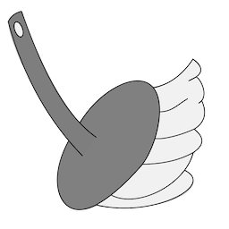

# SwpClear 



# config
when set up

```lua
require("swpclear").setup({
    path="Swp Folder Path"
  })
```

default is "~/.local/state/nvim/swap/"

# command 
delete files in path folder

```vim
:SwpClear
```
